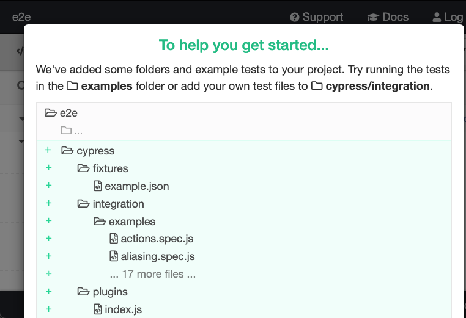
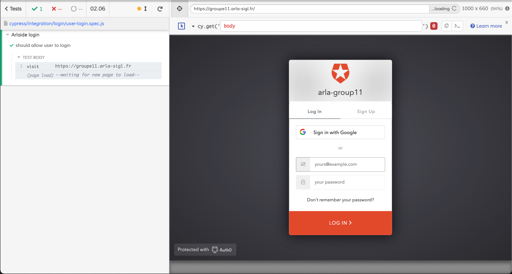
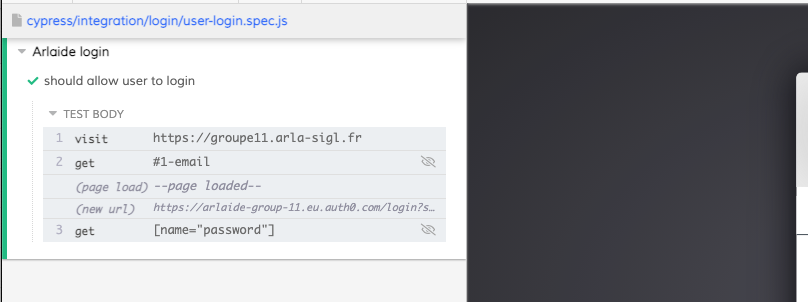
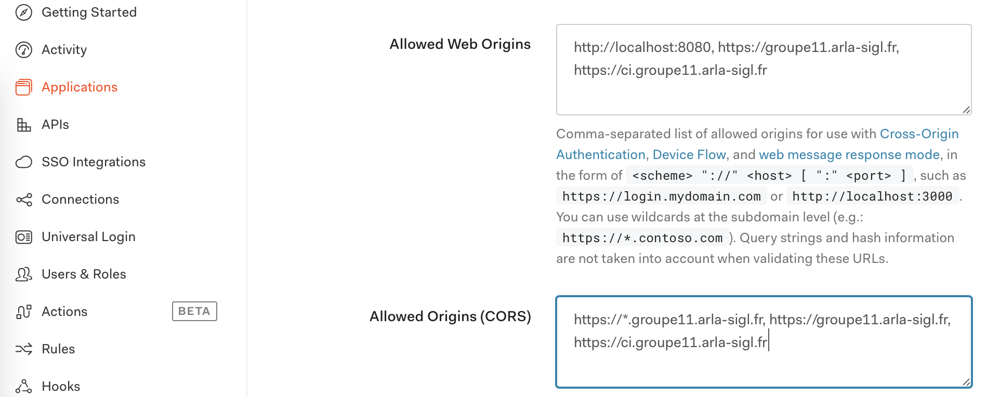

# QA workshop

This workshop is made for EPITA SIGL 2021 students.

You will learn how to:
- implement unit test in Node using [Jest](https://jestjs.io)
- implement basic fonctional in Node test using [Cucumber](https://cucumber.io)
- implement e2e test in Node using [Cypress.io](https://cypress.io)
- configure a CI environment 
- integrate tests to your CD pipeline

## Step 1: Implement unit test

Let's create a unit test in your web-api. 

Your API is using a paging system based on 2 query parameters `page` and `limit`.
The logic is written inside the `src/utils.ts` package, in the function `extractPageOptions`.

You will write a set of unit test to make sure that the method works as expected.

### Install Jest

To implement unit tests, you will use a new node module called [Jest](https://jestjs.io).
> Note: You often encounter mainly two JavaScript testing frameworks: [Jest](https://jestjs.io) and [Mocha](https://mochajs.org).
> Those two tools serve same purpose, but we found that Jest offers a better development experience. This is important since developpers are often lazy to write tests!

To install Jest, install it like any other node modules (from your API project):
```sh
# From your api/ folder:

# make sure you have correct node version activated
nvm use
# install the jest module with a package to config jest with TypeScript
npm i --save-dev ts-jest jest @types/jest
# Create a default jest config
npx ts-jest config:init
# It should create a jest.config.js 
```

Now, let's add a new script inside your `package.json` file to run test using jest when typing `npm test`:
```json5
// ...
  "scripts": {
    // "build": ...,
    // ...,
    "test": "jest --passWithNoTests"
  }
```

Now try to run test typing `npm test` or `npm t`. You should see the following output:
```log
> ...
> jest --passWithNoTests

No tests found, exiting with code 0
```

If you see this logs, it means you've correctly set Jest.

### Create coverage for `extractPageOptions`

Now that Jest is correctly set, let's create some unit test for `extractPageOptions`.

First, let's refactor the function to make it easier to test.

#### Refactor extractPageOptions to ease the writing of unit test

First, the `asNumber` method had a flaw (we actually noticed it by implementing a unit test!). 
Rewrite the `asNumber` function as follow:
```ts
// From api/src/utils.ts
// ...

// Try to cast to the query option to a number;
// throws an error otherwise
const asNumber = (query: qs.ParsedQs, optionName: string) => {
  const queryOption = query[optionName];
  const invalidFormatError = new Error(
    `${optionName} needs to be a valid number`
  );

  if (typeof queryOption === "string") {
    const n = +queryOption;
    if (isNaN(n)) throw invalidFormatError;
    return n;
  } else {
    throw invalidFormatError;
  }
};
```

The current implementation of `extractPageOptions` is taking the whole express Request object, which is too complex and cumbersome to create for a unit test.

Instead, you will refactor the `extractPageOptions` to directly take the `query` as parameter; which is only a dictionary:
```ts
// Inside api/src/utils.ts
//...
export const extractPageOptions = (
  query: qs.ParsedQs
) => {
    
    // ...
}
```

And replace the paramaters where `extractPageOptions` is used inside `api/src/server.ts`:
```ts
// Inside server.ts; where you had the former extractPageOptions
// ...
const { page, limit } = extractPageOptions(request.query);
// ...
```

#### Create unit tests

Let's first create a simple unit test to check the expected behaviour of the `extractPageOption` fuction.

Create a new file `api/src/utils.spec.ts` with:
```ts
import qs from "qs";
import { extractPageOptions } from "./utils";

describe("extractPageOptions", () => {
  
  it("should correctly extract page and limit options when present", () => {
    const validQuery: qs.ParsedQs = {
      page: "1",
      limit: "10"
    };
    const { page, limit } = extractPageOptions(validQuery);
    expect(page).toEqual(1);
    expect(limit).toEqual(10);
  });

}
```

Now run this test and make sure it's running without error:

```sh
# Both `npm t` and `npm test` are equivalent
npm test
# Output:
# > template-api@1.0.0 test ...
# > jest --passWithNoTests
# 
#  PASS  src/utils.spec.ts
#   extractPageOptions
#     ✓ should correctly extract page and limit options when present (3 ms)
# 
# Test Suites: 1 passed, 1 total
# Tests:       1 passed, 1 total
# Snapshots:   0 total
# Time:        1.911 s, estimated 2 s
# Ran all test suites.
```

Now, to make sure test is correctly implemented, let's make it fail on purpose.
Replace `expect(page).toEqual(1);` by `expect(page).toEqual(1000);`, and run `npm test` again.

You should see an error like:
```log

> template-api@1.0.0 test ...
> jest --passWithNoTests

 FAIL  src/utils.spec.ts
  extractPageOptions
    ✕ should correctly extract page and limit options when present (5 ms)

  ● extractPageOptions › should correctly extract page and limit options when present

    expect(received).toEqual(expected) // deep equality

    Expected: 1000
    Received: 1

      10 |     };
      11 |     const { page, limit } = extractPageOptions(validQuery);
    > 12 |     expect(page).toEqual(1000);
         |                  ^
      13 |     expect(limit).toEqual(10);
      14 |   });
      15 | 

      at Object.<anonymous> (src/utils.spec.ts:12:18)

Test Suites: 1 failed, 1 total
Tests:       1 failed, 1 total
Snapshots:   0 total
Time:        2.314 s
Ran all test suites.
npm ERR! Test failed.  See above for more details.
```

You can see that the test failed, as expected!

Revert changes to make it green again (`expect(page).toEqual(1);` instead of `expect(page).toEqual(1000);`)


Let's add new unit test to check if errors are correclty thrown when one of the option is missing:

```ts
  // inside describe() after the first it()  
  // ...
  it("should throw an error when page is missing", () => {
      const onlyLimit: qs.ParsedQs = {
          limit: "10"
      };
      expect(() => extractPageOptions(onlyLimit)).toThrowError(
        new Error("page needs to be a valid number")
      );
  });

  it("should throw an error when limit is missing", () => {
    const onlyPage: qs.ParsedQs = {
        page: "10"
    };
    expect(() => extractPageOptions(onlyPage)).toThrowError(
      new Error("limit needs to be a valid number")
    );
  });
  // ...
```

Now add a unit test to check if an error is thrown when a given option is not a valid number:

```ts
// ...
    it("should throw an error when page is not a number", () => {
      const invalidPageNaN = {
          page: "page1",
          limit: "10"
      }
      expect(() => extractPageOptions(invalidPageNaN)).toThrowError(
          new Error("page needs to be a valid number")
      )
// ...
});
```

Your turn to practice!

Try to implement a unit test to check that an error is thrown when the option page is a negative number:
```ts
    it("should throw an error when page is negative", () => {
        // TODO: your turn to practice!
    })
``` 

## Step 2: Implement functional test

Now, let's step up to a higher level of test: functional tests.

You will use [Cucumber](https://cucumber.io) to write [BDD](https://en.wikipedia.org/wiki/Behavior-driven_development) tests using the NodeJS implementation [Cucumber-js](https://cucumber.io/docs/installation/javascript/).

This tool seperates the test specification in seperated `.feature` files. Those features can be written by non-dev people in your team, and goes in the direction of BDD for writing tests.

In this step, you will write a scenario that tests the paging on your `help-request` web api.

This will be a nice functional test testing if the API works as expected, including the connection to the database.

### Start your API with PostgreSQL

Before starting the Cucumber specification, you should start :
1. PostgreSQL used in the last workshop (with the data loaded):
  - launch the docker-compose from the `arlaide-database` project: `docker-compose up -d`
1. your web API **disabling** (for now) authentication on your `v1/help-request` route:
  - To do so, you just have to remove or comment the `jwtCheck` in the parameter of the route handler.

Make sure you can access help-requests on http://localhost:3000/v1/help-request?page=1&limit=15

### Cucumber

We prepared already necessary code under the `cucumber` folder of this repository.

Copy the whole `cucumber` folder at the root of your groupXX's repository.

Then, move to the cucumber folder, and install dependencies:
```sh
# From cucumber/ folder
nvm use
npm install
```

Then, have a look at the test inside the [cucumber/features](cucumber/features) folder:

```plain
# inside cucumber/features/help_requests.feature
Feature: Help Requests

    We want to query help requests page by page

    Scenario Outline: Query pages of different sizes
        Given <page> and <limit>
        When a User calls help request API
        Then the User should recieve <numberOfHelpRequests>

        Examples:
            | page | limit | numberOfHelpRequests |
            | 1    | 5     | 5                    |
            | 2    | 10    | 10                   |
            | 3    | 15    | 15                   |
```

This cucumber feature describes in a templated way how the help-request API should behave
when a user calls the API with different `page` and `limit` options.

Note that you are outside of the code of your web API, as opposed to your unit tests behing directly inside the code of your API.

Then, the corresponding step definitions:
```js
// inside cucumber/features/step_definitions/helpRequests.js
const assert = require("assert");
const fetch = require("node-fetch");
const { Given, When, Then } = require("@cucumber/cucumber");

Given("{int} and {int}", (page, limit) => {
  this.page = page;
  this.limit = limit;
});

When("a User calls help request API", async () => {
  const response = await fetch(
    `http://localhost:3000/v1/help-request?page=${this.page}&limit=${this.limit}`
  );
  const json = await response.json();
  this.apiResponse = json;
});

Then("the User should recieve {int}", (expectedNumberOfHelpRequests) => {
  if (this.apiResponse) {
    assert.strictEqual(this.apiResponse.length, expectedNumberOfHelpRequests);
  } else {
    assert.fail("no API response!");
  }
});
```
> Note: For simplicity, we kept the code in JavaScript, it is possible to use TypeScript but we
> think it is unecessary complexity for this workshop.

This code implements the corresponding behaviour of each steps define in the `.feature` file:
```plain
...
        Given <page> and <limit>
        When a User calls help request API
        Then the User should recieve <numberOfHelpRequests>
        
```
Where corresponding steps are linked with the same `Given`, `When` and `Then` message:
```js
// Given <page> and <limit>
Given("{int} and {int}", ...);

// a User calls help request API
When("a User calls help request API", ...);

// Then the User should recieve <numberOfHelpRequests>
Then("the User should recieve {int}", ...);
```

## Step 3: Implement e2e test with Cypress

Let's install cypress.

To do so, you will create a new `e2e` folder at the root your project's repository.
You will setup nvm to use version 14 by creating a new file `.nvmrc` with:
```plain
v14
```

From your e2e/ folder, initiate a new node project by typing:
```sh
# from e2e/
nvm use
npm init --yes
```

Then, just install cypress using npm:
```sh
# from e2e
# make sure your using correct node: nvm use
npm i --save-dev cypress
```

Then add a new `script` entry in your `e2e/package.json` file:
```json5
  //...
  "scripts": {
    //...
    "cypress:open": "cypress open"
    //...
  }
```

Finally, open cypress locally by running:
```sh
# from e2e/
# make sure you're using correct node version: nvm use
npm run cypress:open
```

After some time, you should see a new window on your computer like:


Cypress provides you with some example E2E tests.

After clicking on `OK, got it!`, feel free to run some tests from this cypress console to see how cypress works.

Source code of those test has been added under `e2e/cypress/integration/examples` folder.

### Get started with Cypress in Arlaide

Now that you can run tests from your machine, let's create an E2E test on Arlaide.

As of today, you should all have login configured on your applications.

So let's create a nice e2e test to verify that a user can login.

### Create a user for cypress in your OAuth0 dashboard

In order to login when running your E2E test, you need a valid user.

From your dashboard of your IDP (OAuth0 in this case), create a new user with name and password of your choice.

Once it is created, make sure you can login to your application with your newly created user, either from localhost or directly from your production address (https://groupeXX.arla-sigl.fr)

### Write your login spec

Cypress executes `spec` (for specifications), which describe numberous steps with assertion about what the user is suppose to see, recieve when he clicks/types on some elements.

Let's create a new `spec` folder called `login`.

You will create this folder under `e2e/cypress/integration/` folder.

Create a new empty spec `user-login.spec.js`, inside your recently created `login` folder with:
```js
// inside e2e/cypress/integration/login/user-login.spec.js
describe("Arlaide login", () => {
  // Replace it with your groupe address
  const arlaideUrl = "https://groupeXX.arla-sigl.fr";
  it("should allow user to login", () => {
    cy.visit(arlaideUrl);
  })
})
```

Make sure you've adapted `arlaideUrl` to your group address.

You should see a new spec in your cypress console:


> If you killed your console, you can start it again with `npm run cypress:open` from e2e/ folder

Now let's run it, and you should see your login page:



> Note: Here we use groupe11.arla-sigl.fr

Sofar, we the simpliest test: you visit the login page of arlaide.

**How to interact with elements from cypress javascript spec ?**

First, you need to use [get selector](https://docs.cypress.io/api/commands/get.html#Syntax) to target an element of the DOM.

You have many ways to select an element, and we refer you to examples in the cypress documentation: https://docs.cypress.io/api/commands/get.html#Examples

The html login page is returned by Auth0. So you have to inspect the login page from your browser to see if you have some unique id to query the username and password input.

Let's pick two selectors: 
- `#1-email` to query the DOM element with `id='1-email'`. This will target username/email input field
- `[name="password"]` to query the DOM element with the attribute `name="password"`. This will target the password input field

In your specs, add the following lines after visiting arlaide:
```js
    cy.visit(arlaideUrl);
    cy.get('#1-email');
    cy.get('[name="password"]');
```

And disable chrome security to allow selection in iframes:
```json
// from e2e/cypress.json
{
  "chromeWebSecurity": false
}
```

Run again the `user-login` spec from cypress console.

You should see that your select commands worked, from the logs on the left:


Let's interact with inputs!

Use the [.type() command]() from cypress, and enter username and password of your recently created e2e user in Auth0:
```js
// from e2e/cypress/integration/login/user-login.spec.js
    //...
    cy.get('#1-email').type('E2E USERNAME');
    cy.get('[name="password"]').type('E2E PASSWORD');
```

Now, add a last line to select and [click](https://docs.cypress.io/api/commands/click.html#Syntax) on the login button:
```js
  //...
  cy.get('[aria-label="Log In"]').click();
```

Then, your last step is to expect what user is suppose to see after login.

For the case of groupe11, users is redirected to this main page where she/he should see the `FRONTEND WORKSHOP` header.

Using the [should cypress command](https://docs.cypress.io/api/commands/should.html#Examples), it would look like:
```js
//...
cy.get('h1').contains('Frontend Workshop').should('be.visible') 
```

It gets any `h1` tags that contains `Frontend Workshop` as a direct child and check if the element is visible.

Your turn to play!!

Adapt your spec and expect at least 1 element that a user is suppose to see when logging in successfully.

Once it is green, make sure test is failing if you enter wrong credentials as email/password.

## Step 4: Create a CI environment 

In this step, you will setup a new environment: CI for Continuous Integration.

The CI environment hosts your release candidates (RC).

Your CI environment will expose:
- Frontend on https://ci.groupeXX.arla-sigl.fr
- Web API on https://api.ci.groupeXX.arla-sigl.fr

Create a new branch called `create-ci-env` (`git checkout -b create-ci-env`). 

Make sure all of the following changes are on this branch. This will be usefull for the last part of this step.

### Different Database instances

We created for you 2 different instances of Postgresql:
1. ci.postgres.arla-sigl.fr: your CI (for Continuous Integration) instance of Postgres
2. pro.postgresq.arla-sigl.fr: your production (pro) instance of Postgres

And 2 different instances of MongoDB:
1. ci.mongo.arla-sigl.fr: your CI instance of MongoDB
1. pro.mongo.arla-sigl.fr: your production instance of MongoDB

The CI databases are the one you will use to run tests. This will enable you not to compromise any real data from your end users when executing some tests.

> Note: We prefilled both of the databases with data from the arlaide-database workshop

We also created one database user per group.
Credentials for both databases are:
- Database name: arlaide-group-XX (e.g. `arlaide-group-1`, `arlaide-group-10`...)
- username: arlaide-group-XX (e.g. `arlaide-group-1`, `arlaide-group-10`...)
- password: arlaide-group-XX (e.g. `arlaide-group-1`, `arlaide-group-10`...)

> Note: you can't access both databases from your local machine, but only from the Scalway machines.

### Adapt your web api

Change your dockerfile to take DB connection as `docker build` arguments. This will help us configure
different image depending on which stage you want your image to run on (local, ci or pro).

Apply changes to your `api/Dockerfile` like:

```dockerfile
FROM node:14-alpine

COPY . /code
WORKDIR /code


ARG db_host
ARG db_port
ARG db_name
ARG db_user
ARG db_password

ARG doc_db_host
ARG doc_db_port
ARG doc_db_name
ARG doc_db_user
ARG doc_db_password

ENV RDS_HOST=${db_host}
ENV RDS_PORT=${db_port}
ENV RDS_NAME=${db_name}
ENV RDS_USER=${db_user}
ENV RDS_PASSWORD=${db_password}

ENV DOC_DB_HOST=${doc_db_host}
ENV DOC_DB_PORT=${doc_db_port}
ENV DOC_DB_NAME=${doc_db_name}
ENV DOC_DB_USER=${doc_db_user}
ENV DOC_DB_PASSWORD=${doc_db_password}

RUN npm i
CMD npm start

EXPOSE 3000

```

In your `api/src/db.ts` file, change the RDS connection configuration as bellow:
```ts
// in the nampespace RDS 
const pool = new Pool({
        host: process.env.RDS_HOST || "localhost",
        port: +(process.env.RDS_PORT || 5432),
        database: process.env.RDS_NAME || "arlaide",
        user: process.env.RDS_USER || "sigl2021",
        password: process.env.RDS_PASSWORD || "sigl2021"
    });

// in namespace DocumentDB
//...
  const MONGO_HOST = process.env.DOC_DB_HOST || 'localhost';
  const MONGO_PORT = process.env.DOC_DB_PORT || 27017; 
  const MONGO_DB_NAME = process.env.DOC_DB_NAME || 'arlaide';
  const MONGO_USER = process.env.DOC_DB_USER || 'sigl2021';
  const MONGO_PASSWORD = process.env.DOC_DB_PASSWORD || 'sigl2021';

  const uri = `mongodb://${MONGO_USER}:${MONGO_PASSWORD}@${MONGO_HOST}:${MONGO_PORT}?authSource=${MONGO_DB_NAME}`;

  const find = <T>(collectionName: string) => async (findQuery: FilterQuery<T>) => {
        //...
        const database = client.db(MONGO_DB_NAME);
        //...
  }
  //...

```

### Create a new CI workflow

Before creating a new workflow, remove the pull_request trigger of from every workflows files that you currently have.

For instance, you should remove the `pull_request: ...` close 
```yml  
  # This is a basic workflow to help you get started with Actions
  name: CD

  # Controls when the action will run. Triggers the workflow on push or pull request
  # events but only for the master branch
  on:
    push:
      branches: [ master ]
    # REMOVE 2 lines below
    pull_request:
      branches: [ master ]
```
So it should look like:
```yml
  # This is a basic workflow to help you get started with Actions
  name: CD

  # Controls when the action will run. Triggers the workflow on push or pull request
  # events but only for the master branch
  on:
    push:
      branches: [ master ]
  # ...
```

In your github action, add a `.github/workflows/ci.yml` file with :
> NOTE: make sure to replace \<git_user\>/\<arla-group-XX\> by your group's info (e.g. for group11 ffauchille/arla-group-11)

```yml
name: Deploy CI

on:
  pull_request:
    branches: [ master ]

jobs:
  build-and-deploy-ci-api:
    runs-on: ubuntu-latest

    steps:
      - uses: actions/checkout@v2

      - name: Build and publish docker image
        run: | 
          docker build --build-arg db_host=${{ secrets.RDS_CI_HOST }} --build-arg db_port=${{ secrets.RDS_CI_PORT }} --build-arg db_name=${{ secrets.RDS_CI_NAME }} --build-arg db_user=${{ secrets.RDS_CI_USER }} --build-arg db_password=${{ secrets.RDS_CI_PASSWORD }} --build-arg doc_db_host=${{ secrets.DOC_DB_HOST }} --build-arg doc_db_port=${{ secrets.DOC_DB_PORT }} --build-arg doc_db_name=${{ secrets.DOC_DB_NAME }} --build-arg doc_db_user=${{ secrets.DOC_DB_USER }} --build-arg doc_db_password=${{ secrets.DOC_DB_PASSWORD }} -t docker.pkg.github.com/<git_user>/<arla-group-XX>/arlaide-api-ci:${{ github.sha }} api/
          docker login docker.pkg.github.com -u ${{ secrets.DOCKER_USER }} -p ${{ secrets.DOCKER_PASSWORD }}
          docker push docker.pkg.github.com/<git_user>/<arla-group-XX>/arlaide-api-ci:${{ github.sha }}

      - name: Deploy on production VM
        uses: appleboy/ssh-action@master
        env:
          TAG: ${{ github.sha }}
        with:
          host: ${{ secrets.SSH_HOST }}
          username: ${{ secrets.SSH_USER }}
          key: ${{ secrets.SSH_KEY }}
          envs: TAG
          script: |
            docker login docker.pkg.github.com -u ${{ secrets.DOCKER_USER }} -p ${{ secrets.DOCKER_PASSWORD }}
            docker pull docker.pkg.github.com/<git_user>/<arla-group-XX>/arlaide-api-ci:$TAG
            (docker stop arlaide-api-ci && docker rm arlaide-api-ci) || echo "Nothing to stop..."
            docker run -d --network web --name arlaide-api-ci --label traefik.enable=true --label traefik.docker.network=web --label traefik.frontend.rule=Host:ci.api.${{ secrets.SSH_HOST }} --label traefik.frontend.port=3000 docker.pkg.github.com/<git_user>/<arla-group-XX>/arlaide-api-ci:$TAG
  
  build-and-deploy-frontend-ci:
    runs-on: ubuntu-latest

    steps:
      - uses: actions/checkout@v2

      - name: Build and publish docker image
        run: | 
          docker build --build-arg api_url=https://ci.api.${{ secrets.SSH_HOST }} -t docker.pkg.github.com/<git_user>/<arla-group-XX>/arlaide-ci:${{ github.sha }} .
          docker login docker.pkg.github.com -u ${{ secrets.DOCKER_USER }} -p ${{ secrets.DOCKER_PASSWORD }}
          docker push docker.pkg.github.com/<git_user>/<arla-group-XX>/arlaide-ci:${{ github.sha }}

      - name: Deploy on production VM
        uses: appleboy/ssh-action@master
        env:
          TAG: ${{ github.sha }}
        with:
          host: ${{ secrets.SSH_HOST }}
          username: ${{ secrets.SSH_USER }}
          key: ${{ secrets.SSH_KEY }}
          envs: TAG
          script: |
            echo "TAG: $TAG"
            docker login docker.pkg.github.com -u ${{ secrets.DOCKER_USER }} -p ${{ secrets.DOCKER_PASSWORD }}
            docker pull docker.pkg.github.com/<git_user>/<arla-group-XX>/arlaide-ci:$TAG
            (docker stop arlaide-ci && docker rm arlaide-ci) || echo "Nothing to stop..."
            docker run -d --network web --name arlaide-ci --label traefik.enable=true --label traefik.docker.network=web --label traefik.frontend.rule=Host:ci.${{ secrets.SSH_HOST }} --label traefik.frontend.port=80 docker.pkg.github.com/<git_user>/<arla-group-XX>/arlaide-ci:$TAG
```

Then, create new secrets use in this new `ci.yml` github workflow.
From your github repository, go to Settings > Secrets and add the follwing secrets values:
- RDS_CI_HOST: ci.postgresql.arla-sigl.fr
- RDS_CI_PORT: 5432
- RDS_CI_NAME: arlaide-group-XX (replace XX by your group number)
- RDS_CI_PASSWORD: arlaide-group-XX (replace XX by your group number)
- RDS_CI_USER: arlaide-group-XX (replace XX by your group number)

- DOC_DB_HOST: ci.mongo.arla-sigl.fr
- DOC_DB_PORT: 27017
- DOC_DB_NAME: arlaide-group-XX (replace XX by your group number)
- DOC_DB_USER: arlaide-group-XX (replace XX by your group number)
- DOC_DB_PASSWORD: arlaide-group-XX (replace XX by your group number)

### Adapt your frontend build

Modify your build script inside your frontend/package.json:
```json5
//...
 "scripts": {
    "build": "webpack --mode production --env.API_ENDPOINT=${API_ENDPOINT}",
    "start": "webpack-dev-server --open"  
  },
//...
```

and the frontend's Dockerfile like:
```Dockerfile
FROM node:14-alpine AS build

COPY frontend /code/
WORKDIR /code

ARG api_url
ENV API_ENDPOINT=${api_url}

RUN npm install
RUN npm run build

FROM nginx:stable

COPY --from=build /code/build/* /usr/share/nginx/html/
```

This will enable to setup a different web API url when building the docker image (e.g. https://ci.api.groupeXX.arla-sigl.fr or api.groupeXX.arla-sigl.fr).

This will be use by the ci.yaml workflow file.

### Adapt your Auth configuration

You need to allow auth requests from/to the new ci domain: https://ci.groupeXX.arla-sigl.fr.

> Note: failing to do so would result in CORS issues

From your Auth dashboard > Application add in every sections with url the new CI url (https://ci.groupeXX.arla-sigl.fr).

Here it what it should look like with groupe11:



Save your changes.

### Deploy your CI environment

To deploy your new CI environment, you need to create a new pull request in your github repository.

To do so, push all your changes made from your `create-ci-env` branch:
```sh
git push origin create-ci-env
```

Then, from your github project page, go to the `Pull requests` tab > `New pull request` > select the `create-ci-env` branch > Create pull request.

By creating the pull request, it should trigger a new workflow in the `Action` tab.

Wait for this workflow to be green, and you should be able to log in to: https://ci.groupeXX.arla-sigl.fr

Congratulation! You just created a new environment for Arlaide, which connects to CI databases.

## Step 5: Integrate test to your CD pipeline

This step will be shown in class.
